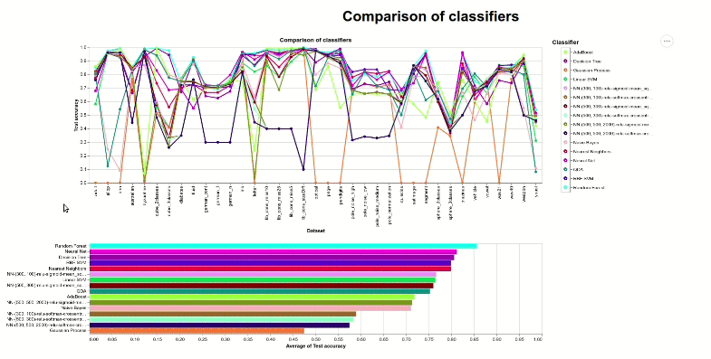
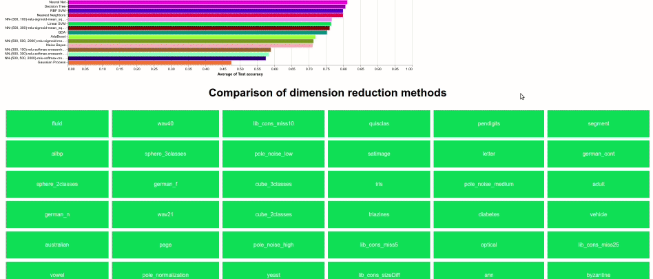

# PV251 Visualization project

### Preview
* [Online visualization preview](https://www.fi.muni.cz/~xkurak/)
* [GitHub](https://github.com/H00N24/PV251-Visualization-project)


This visualization displays a comparison of different classification methods on a set of datasets. In the first part [Comparison of classifiers](Comparison-of-classifiers), we could see the accuracy (cross-validation) for every classifier and dataset.
In the second part, there is a comparison of three dimension reduction methods.

### Interactions
#### Comparison of classifiers
It is possible to select classifier either by clicking on datapoint in the parallel coordinates graph, legend or bar chart showing mean accuracy (see giff bellow).
Interactions help to compare the results for every classifier.


#### Comparison of dimension reduction methods
It is possible to choose the datasets by clicking on the buttons, then you can zoom in/out or select any class to see where it is located in different methods (see giff bellow).
Interactions help to compare the dimension reduction methods.




### Visualization
Requirements:
* python3.6 + venv or virtualenv

```
$ python3 -m venv venv
$ source venv/bin/activate # venv/bin/activate.fish # for fish shell
(venv)$ pip install -r requirements-visualization.txt
(venv)$ ./generate_graphs.py
```

Libraries:
 * [Altair](https://github.com/altair-viz/altair)


#### Description
The visualization consists of two parts:
1. Comparison of classifiers
    - Three linked graphs showing accuracy of classifiers on datasets
    
2. Comparison of dimension reduction methods
    - Three linked graphs (PCA, UMAP, t-SNE) for every dataset


#### Data
All data for the visualization could be found in the `data/` folder. File `classifiers-comparison.csv` contains results for classifiers comparison. The rest are transformed datasets.


### Dimension reduction

```
$ git clone git@github.com:H00N24/IA080-classifiers-comparison.git IA080_classifiers_comparison 
$ python3 -m venv venv
$ source venv/bin/activate # venv/bin/activate.fish # for fish shell
(venv)$ pip install -r IA080_classifiers_comparison/requirements.txt
(venv)$ pip install -r requirements-d-reduction.txt
(venv)$ ./dimension_reduction.py
```

#### Dimension reduction methods
* [t-SNE](https://scikit-learn.org/stable/modules/generated/sklearn.manifold.TSNE.html)
* [PCA](https://scikit-learn.org/stable/modules/generated/sklearn.decomposition.PCA.html)
* [UMAP](https://github.com/lmcinnes/umap)

#### Data
Datasets are from [IA080-classifiers-comparison](https://github.com/H00N24/IA080-classifiers-comparison)